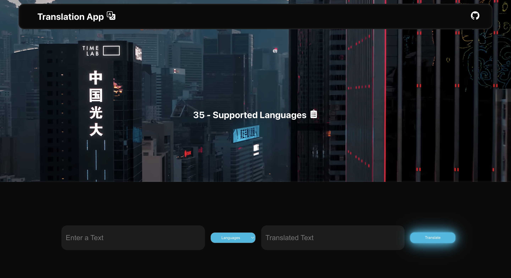

# Translation App
<p align="center">
Translation web application using Translate Plus API

## Supported Languages

<p align="center">
Arabic,                  English,     Irish,               Norwegian,
Armenian,                Finnish,     Italian,             Persian,
Bengali,                 French,      Japanese,            Polish,
Bulgarian,               German,      Korean,              Portuguese (Portugal, Brazil),
Catalan,                 Greek,       Latin,               Russian,
Chinese (Simplified),    Croatian,    Hebrew,              Malay,            
Chinese (Traditional),   Hindi,       Mongolian,           Swedish,
Czech,                   Hungarian,   Myanmar (Burmese),   Turkish,
Danish,                  Nepali,      Ukrainian,           Spanish
Dutch,                  

##



## Get Started

1. Clone this repository and run:
```sh
npm install
```
2. Run the web app:
```sh
npm run start
```
